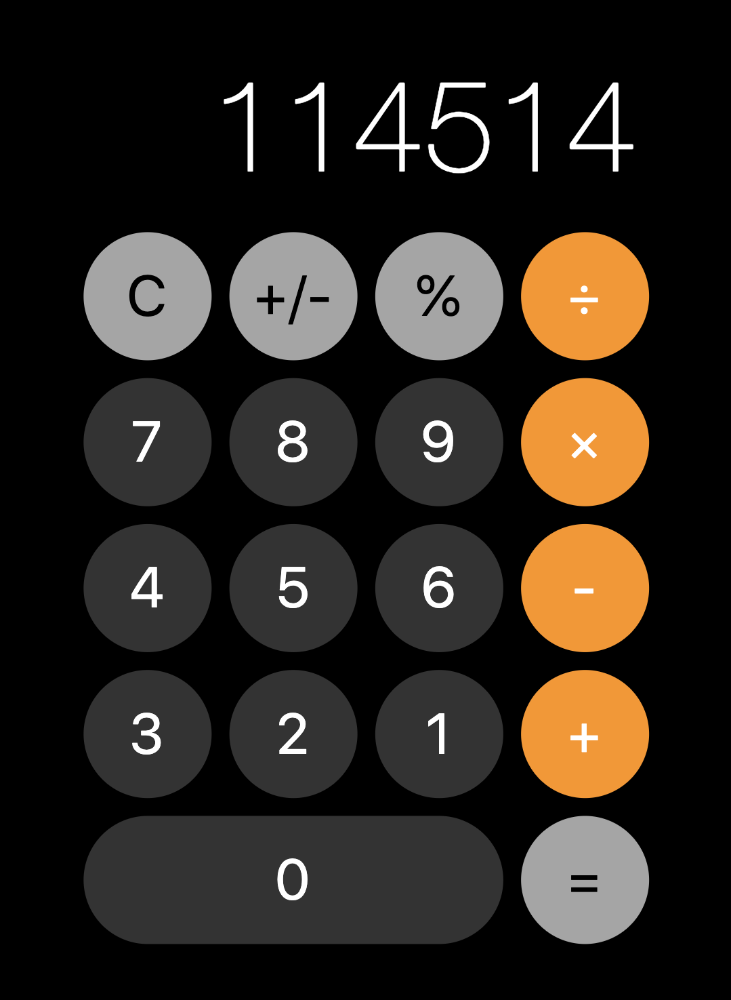

# preact calculator

A basic PWA calculator.
PRs are welcome.

- Preact
- express
- TypeScript
- emotion

## Getting started
1. install dependencies

```sh
$ yarn install
```

2. build and run

```sh
# dev mode (watches for change)
$ yarn run dev

# optionally, run in production mode
$ yarn run build
$ yarn run start
```

3. open in browser

page should be available at http://localhost:3000/


